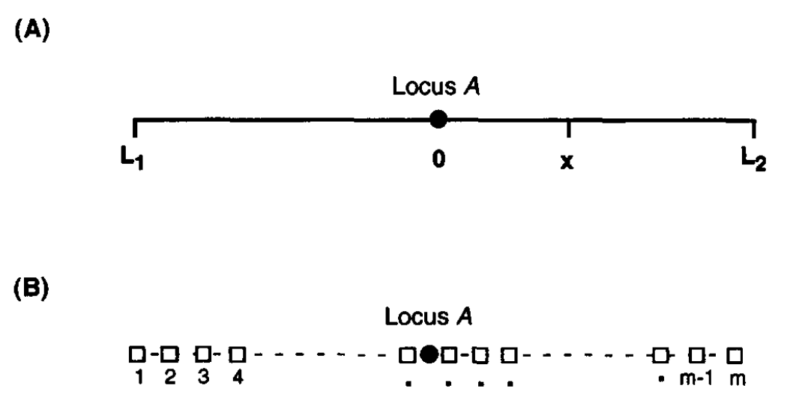
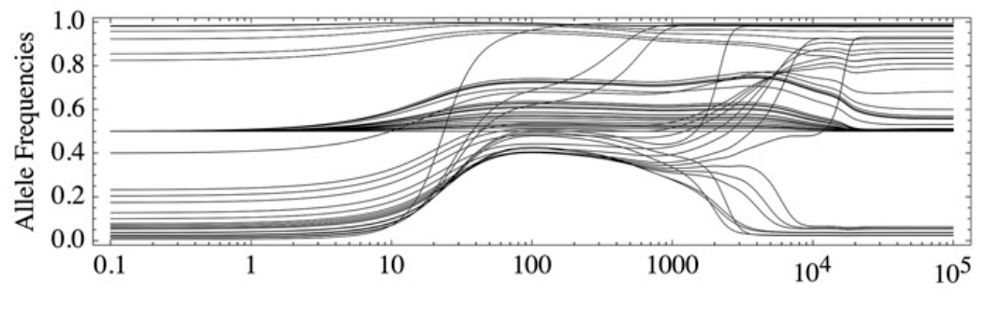

## Linked selection vs. fates of selected mutations

Hudson & Kaplan, 1995 | De Vladar & Barton, 2014
:------:|:----------:
{width=150px}|{height=70px}


## Slide with Bullets

- Bullet 1
- Bullet 2
- Bullet 3

## Slide with R Output


```r
summary(cars)
```

```
##      speed           dist       
##  Min.   : 4.0   Min.   :  2.00  
##  1st Qu.:12.0   1st Qu.: 26.00  
##  Median :15.0   Median : 36.00  
##  Mean   :15.4   Mean   : 42.98  
##  3rd Qu.:19.0   3rd Qu.: 56.00  
##  Max.   :25.0   Max.   :120.00
```

## Slide with Plot


