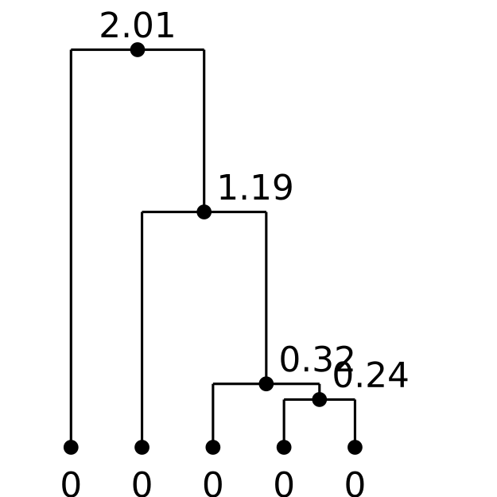
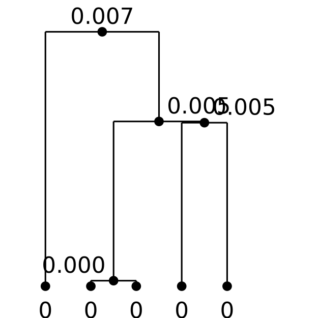
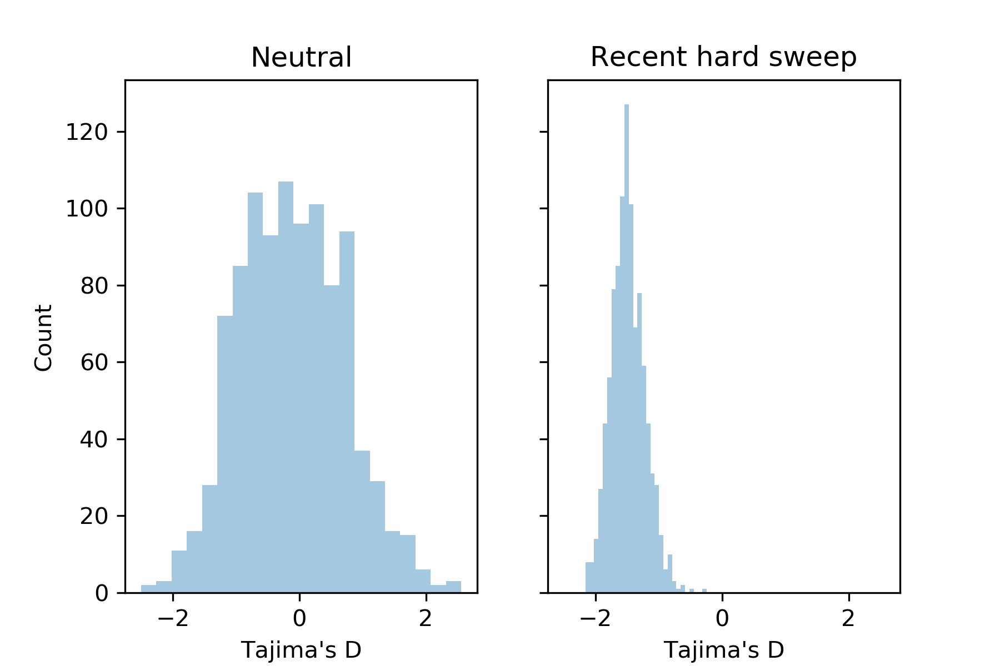
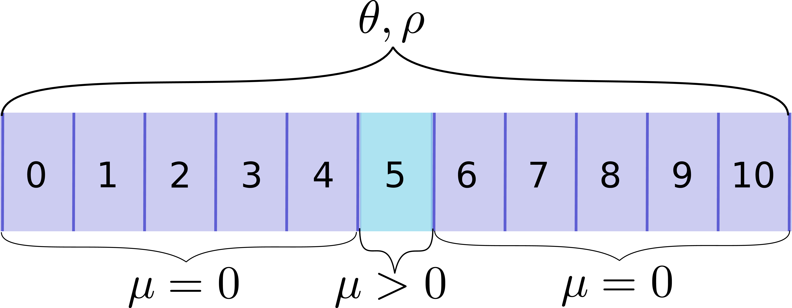
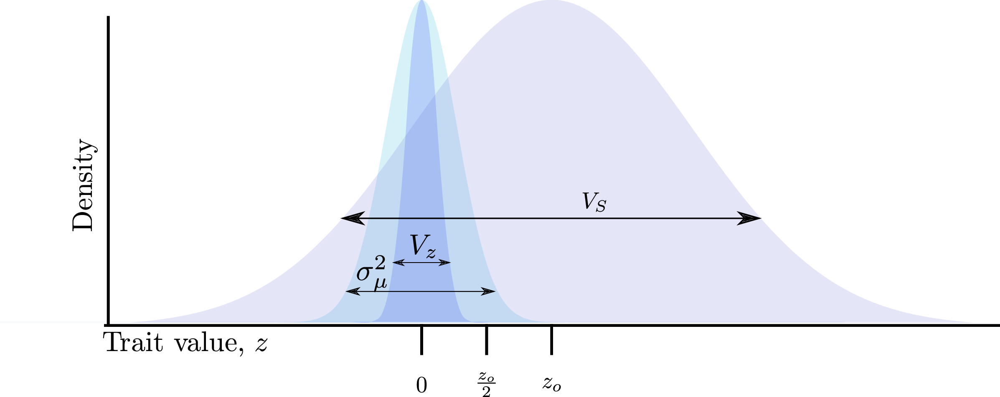
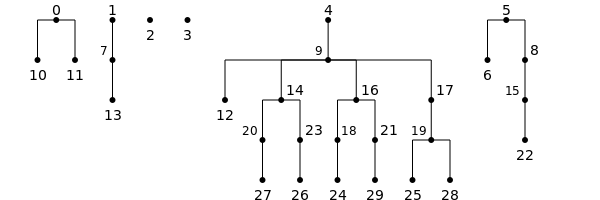
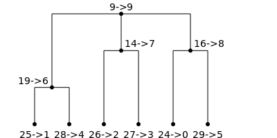

```{r setup, include=FALSE}
knitr::opts_chunk$set(echo = FALSE)
```

## Linked selection vs. fates of selected mutations

Hudson & Kaplan, 1995 | De Vladar & Barton, 2014
:--------:|:----------:
{width=150px}|{height=70px}

## Modeling traditions

Population genetics | Evol. quantitative genetics
:-------------:|:-----------------:
Fixed effect sizes | Variable effect sizes
Single selected site | Many sites
Directional sel'n | Stabilizing selection
Partial linkage | LE or QLE


## Tree structures

Neutral | Recent hard sweep
:------:|:-------------:
{width=200px}|{width=200px}

## Patterns reflect the tree structures

```{r, echo=F,fig.align="center",out.height="2in",out.width="3in"}

#{width=400px}
```

## Linked selection during polygenic adaptation

* Use forward simulations
* [fwdpy11](http://fwdpy11.readthedocs.org) is a Python package
* Uses a C++ [back-end](http://github.com/molpopgen/fwdpp) (Thornton, 2014, Genetics)

## Simulation scheme

A locus | $w = e^{-(z-z_o)^2/(2V_S)}$
:-------------:|:-------------------:
{width=200px}|{width=200px}

* 10 unlinked loci, $\theta = \rho = 1,000$ per locus
* Additive mutations arise at rate $\mu$, $\Theta = 4N\mu$
* Two thetas cannot possibly be confusing.
* $N = 5,000$ diploids
* Evolve under GSS for $10N$ generations with optimal trait value of 0
* Shift optimal trait value to $z_o > 0$ and evolve for $10N$ more generations

## Adaptation occurs *rapidly* and *before* fixation

```{r,echo=F,fig.align="center",out.width="3.5in",out.height="2.5in",fig.cap="Large optimum shift, $z_o = 1$ with $V_S = 1$."}
include_graphics("trajectoriesZoom.pdf")
```

## Contributions of different loci
```{r,echo=F,fig.align="center",out.width="3.5in",out.height="2.5in",fig.cap="Mean trait value \\textit{per locus}, colored by rank."}
include_graphics("MeanGeneticValuePerLocusMIRA.pdf")
```

## Sweeps from SGV start out **rare**

```{r,echo=F,fig.align="center",out.width="3.5in",out.height="2.5in"}
include_graphics("NhapsVsEsizeFixationsAtMSBVienna.pdf")
```

This predicts "hard" sweep signals due to sweeps from large-effect SGV.

## Temporal and spatial patterns of "selection signals"

```{r,echo=F,fig.align="center",out.width="3.5in",out.height="2.5in",fig.cap="Mean statistic per window over time for a large optimum shift. $z$ scores are for the $nS_L$ statistic (Ferrer-Admetlla et al. (2014), MBE"}
include_graphics("HprimenSLVienna.pdf")
```

## Similar patterns for new mutations vs SVG


```{r,echo=F,fig.align="center",out.width="3.5in",out.height="2.5in",fig.cap="Same data, but conditioning on fixations of large effect"}
include_graphics("HprimenSLViennaConditional.pdf")
```

## Mutational variance matters

```{r,echo=F,fig.align="center",out.width="3.5in",out.height="2.5in",fig.cap="Choose $\\sigma_\\mu$ so that probability of a large-effect mutation is constant. Time scale is determined by $\\delta q$ of fixations."}
include_graphics("MeanHprimeVaryPlargeGaussianVienna.pdf")
```


## Implications

* Patterns unique to "soft sweeps" are not generated by this model!
  * We are using supervised machine learning (Schrider/Kern) to further investigate this.
* Hitch-hiking signals *decrease* as $\Theta$ *increases*
  * Keep in mind that our "tests" are usuall designed to detect hard sweeps

Data not shown:

* Small optimum shifts leave less dramatic patterns

## Tree sequences: representing genetic data using tables

```
Kelleher, et al. 2016. PLoS Computational Biology
a.k.a "The msprime paper"
```

```{r,echo=F,fig.align="center",out.width="3.5in",out.height="2.5in"}
include_graphics("example_tree_sequence.pdf")
```

## Tree sequence simplification...

```
Kelleher, et al. 2018. PLoS Computational Biology
```

```{r,echo=F,fig.align="center",out.width="3.5in",out.height="2.5in"}

```

## ...can be done in FAST linear time...

```{r,echo=F,fig.align="center",out.width="3.5in",out.height="2.5in"}

```

## ...and give a huge performance boost...

```{r,echo=F,fig.align="center",out.width="3.5in",out.height="2.5in"}
include_graphics("speedup.pdf")
```
## ...allowing chromosome-scale simulations in large $N$

```{r,echo=F,fig.align="center",out.width="3.5in",out.height="2.5in",fig.cap="$N=2 \\times 10^5$ diploids, $\\rho = 10^5$ ($\\approx 100$MB in humans),$\\gamma \\sim N(0,0.25)$, $V_S= 1$. Analysis based on $n = 3,000$ diploids."}
include_graphics("tiptime.pdf")
```

## Facilitates better testing

* Methods for detecting polygenic adaptation of continuous traits shouldn't be evaluated with simulations of strong
  sweeps.
* Methods assuming linkage equilibrium need to be tested using simulations involving partial linkage
* etc.

## Resources

* \texttt{fwdpy11}: https://fwdpy11.readthedocs.org
* \texttt{msprime}: https://msprime.readthedocs.org
* Tree sequence tutorials: https://tskit-dev.github.io/tutorials/
* The tree sequence toolkit: https://github.com/tskit-dev/tskit ("almost ready")

## Thanks

* David Lawrie
* Khoi Hyunh
* Jaleal Sanjak
* Tony Long
* Jerome Kelleher, Jaime Ashander, Peter Ralph
* NIH for funding
* UCI HPCC for computing support

